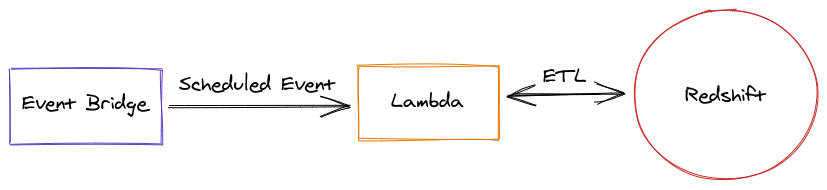

# aws-eventbrige-lambda-redshift
Template repository for a scheduled event bridge with lambda rule to query redshift

## Architecture
The following architecture diagram highlights the templated solution:  

## Testing

1. After setting up above solution, you should have an automated pipeline to trigger based on the schedule you defined in Amazon EventBridge scheduled rule’s cron expression. You may view Amazon CloudWatch logs and troubleshoot issues if any in the lambda function.

2. You could also view the query execution status in Amazon Redshift Console, which would also allow you to view detailed execution plan for the queries you executed.